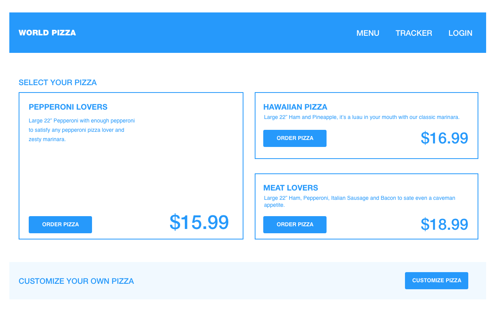
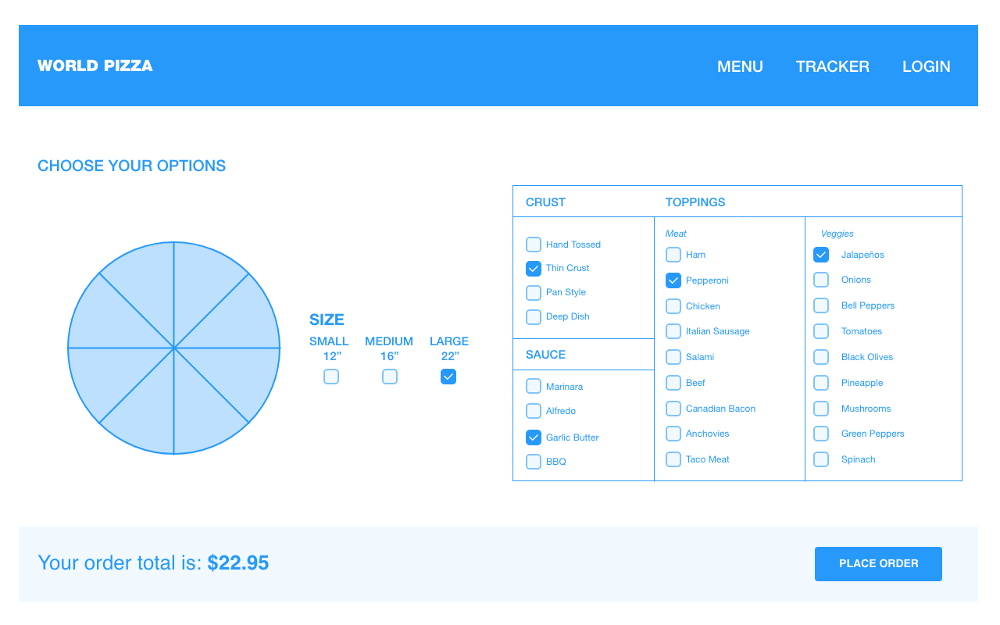
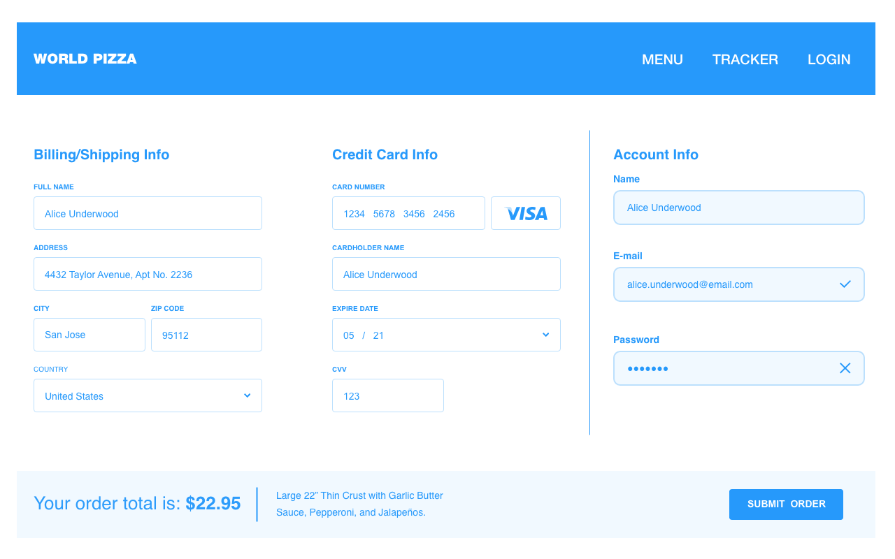
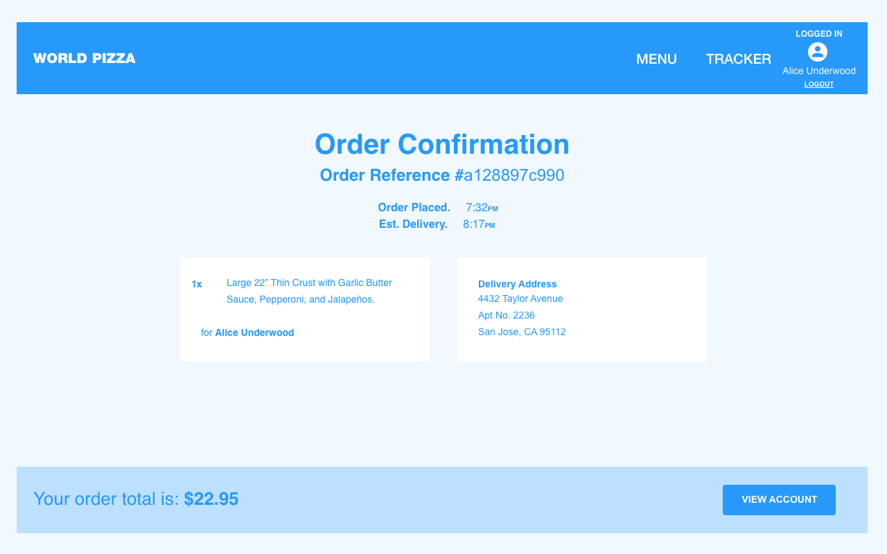
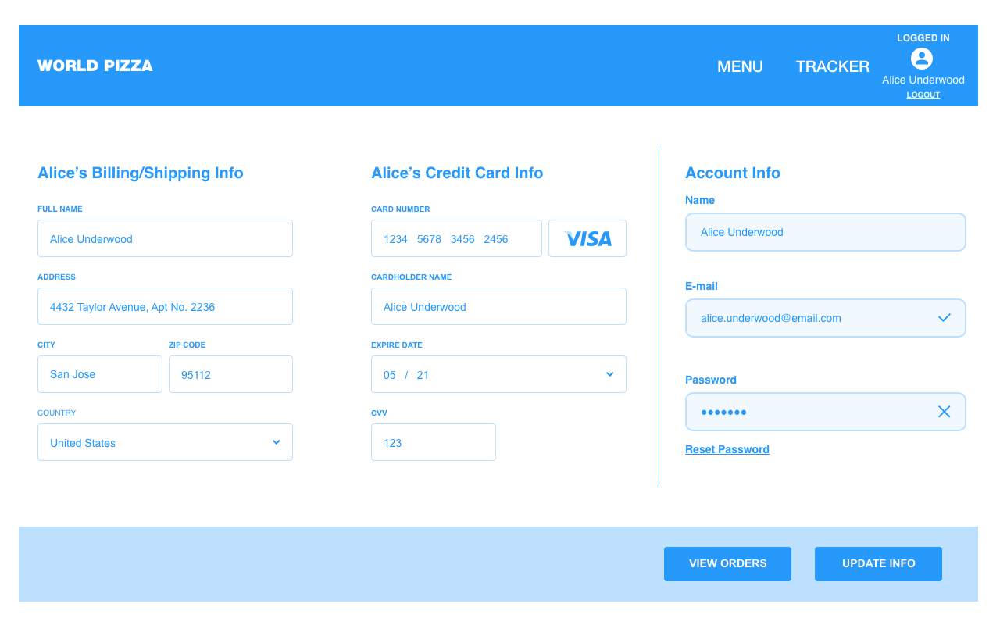
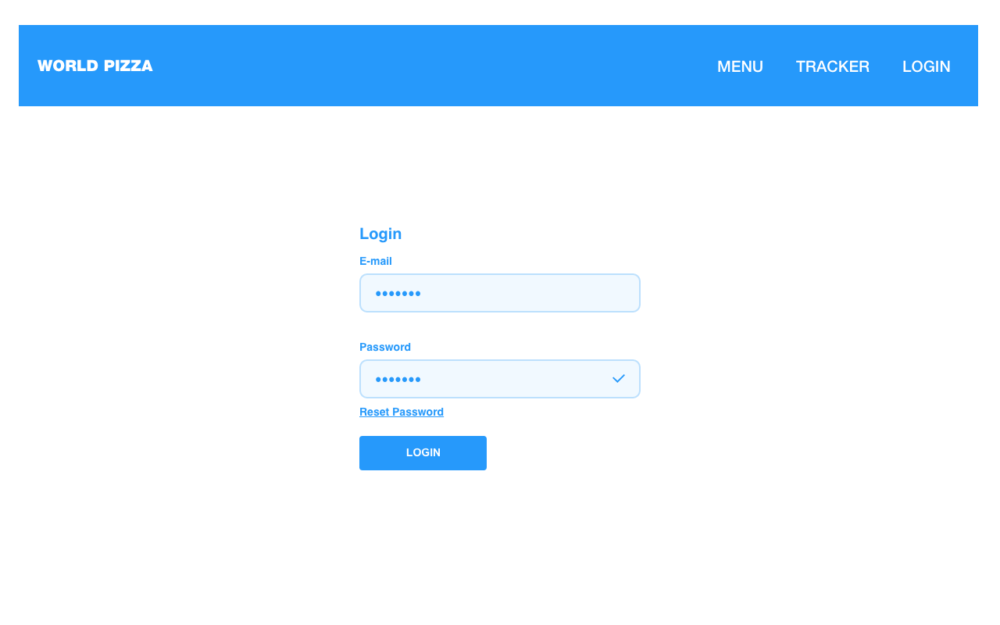
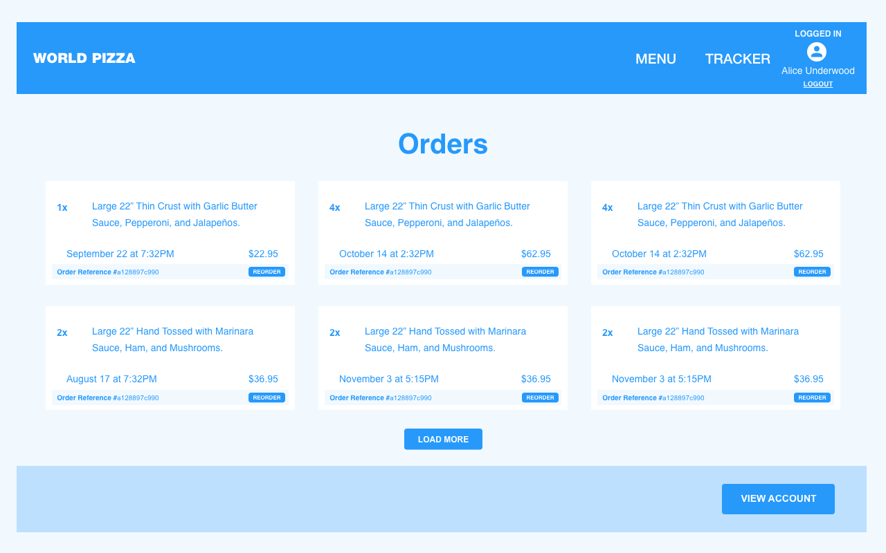
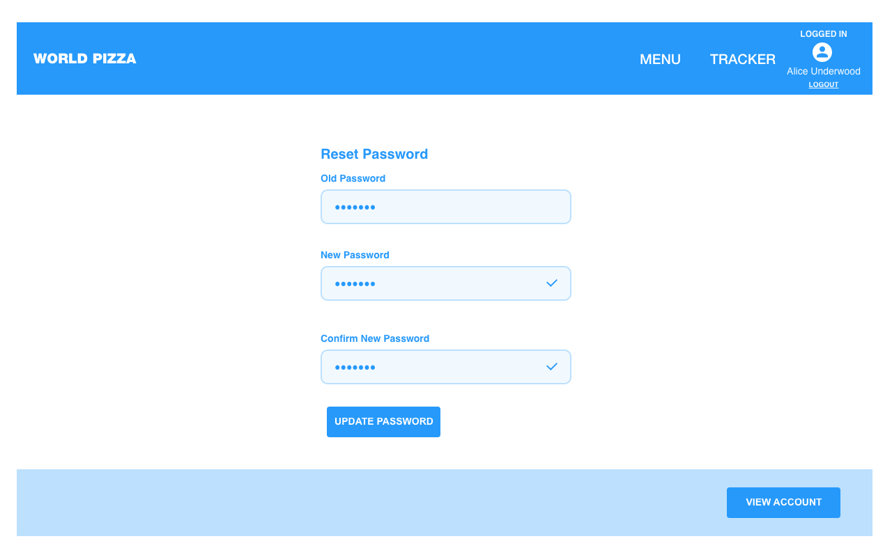
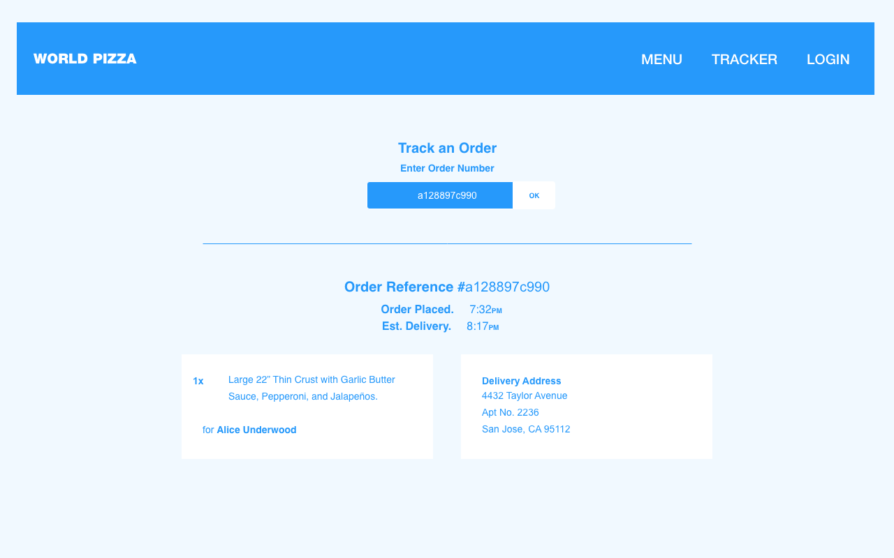
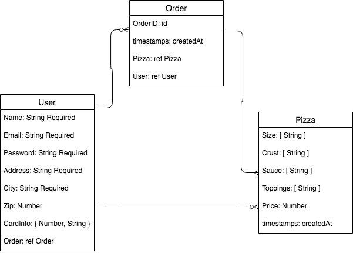

# pizzeria-project

## MVP (bare-bone basics)

- user can access application
- user can select a pizza from menu options
- user can input data (profile information) for purchasing / placing order

---

### User Stories

- User access site
- User click on menu (nav bar)
- User select pizza option
- User checkout -> input information for purchase
- App creates user account on order checkout for reduced friction ordering in the future -> pizza order is assigned an order number linked to customer account (order history)
- App send order receipt / confirmation email on purchase
- User account -> view and edit personal information & view their order history

---

### Milestones

1. Create routes, collections, and models
2. Create entity relationships
3. Ensuring core functionality
4. Design / styling
5. Testing / refactoring
6. Adding stretch goals

---

### Wire Frame Prototype (MVP)

[View Wireframe Prototype](https://xd.adobe.com/view/74be260f-3ac3-4958-9e27-daac76c4976c-21ed/screen/f2e0c8d1-ab6c-49c0-92fa-f0c43adce03f?fullscreen&hints=off)

---

### Wire frames

Index Page

Order Customization

Order Information/Account Creation

Order Confirmation

View/Edit Account

Login Account

View Past Orders

Reset Password

Track Order

---

### MVP Pitch

Eating pizza shouldnt be boring. Leave your dull dining experiences behind, and enter into a reality birthed from the combination of Isaac Asimov and Willy Wonka, a world where imaginative culinary science is no longer fiction.
We are Pizza Planet, your local galactic hub for family fun and some of the best damn pizza in the system. Begin your journey with our app where famished travelers can peruse our menu or build a meal from scratch specific to their liking. Delivery is easy with our fleet of Rocket Drone Delivery Bots who will bake your order en route and hand-deliver your order fresh out of the plasma oven. The future is now.

---

### MVP

This will be an application built for a local pizzeria where at its most basic functionality will allow a user to access the app, open a menu to view item options, build and edit an order from menu items, and complete an order purchase whilst simultaneously creating a user profile.
During checkout, the user will input identification and contact information such as their name, phone, and email which will be their username (address will be optional until the Delivery function is available). They will also create a password before progressing to the payment and final order confirmation page. Each order is assigned an order number which is tagged to the users profile in an archive labeled, Order History which can be referenced by the user. Once an order is purchased, the user will receive an emailed receipt with their order number and purchase summary.

---

### ERD - Create your diagram to represent your database models and their connections

---

### Stretch Goals:

- additional menu item customization
- additional pizza customization options

#### drinks

- sizes - [ String ]
- non-alcoholic - [ String ]
- spiked - [ String ]
- malts - [ String ]
- price - Number

#### sides

- salads - String
- wings - String
- fries - String
- onion rings - String
- price - Number

#### desserts

- cinnamon sticks - String
- churros - String
- planet sized cookie - String
- s'mores brownies - String
- price - Number

#### user accounts

- information storage
- payment storage
- login status
- reward point count
- current order delivery status & tracking

#### order archive

- search & access via order id
- link specific order id with specific user account
